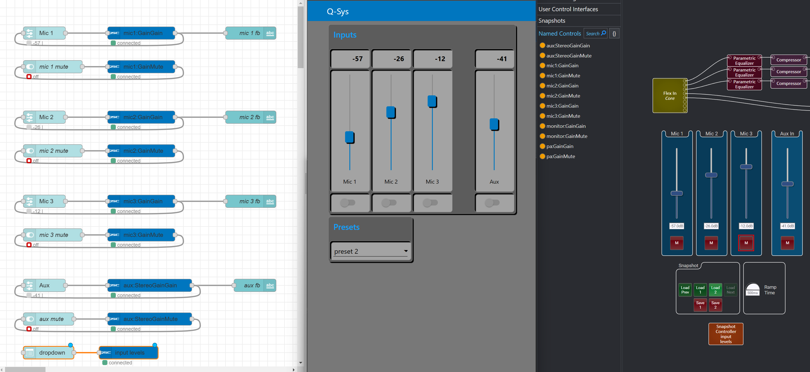
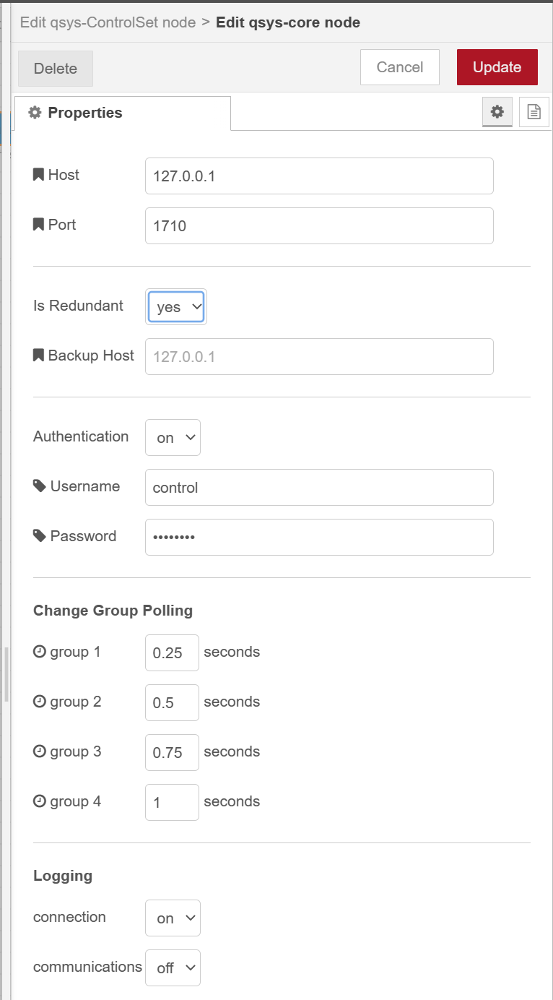
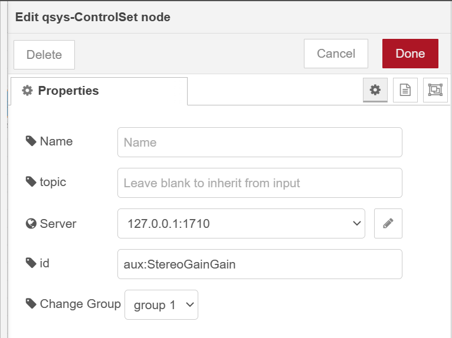
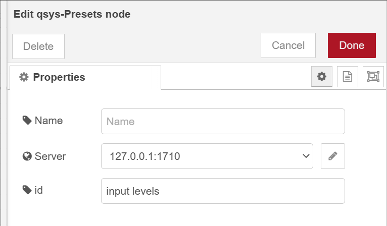

# node-red-contrib-qsys

A collection of nodes for controlling Q-Sys.



---

# Getting Started

## Prerequisites

- [Node.js](https://nodejs.org/en/) v12.13.0 or newer
- [Node-RED](https://nodered.org) v3.0.1 or newer

*untested on earlier versions*

## Installation

Install via Node-RED Manage Palette

`node-red-contrib-qsys`

Install via npm

```
$ cd ~/.node-red
$ npm install node-red-contrib-qsys
# then restart node-red
```

# Nodes

## qsys-core (config node)

Manages connection to the Q-Sys Core.



## qsys-ControlSet

To be used with named controls. Auto subscribes to a change group when deployed.



## qsys-Control-Preset



# Resources

- [Q-Sys website](https://www.qsys.com/)
- [QRC Commands](https://q-syshelp.qsc.com/Content/External_Control_APIs/QRC/QRC_Commands.htm)

# Feature Requests / Bug Reporting

Please report any bugs or issues to the repository [here](https://github.com/dudest/node-red-contrib-qsys/issues).

# Task List

- [ ] Lab test redundant core logic
